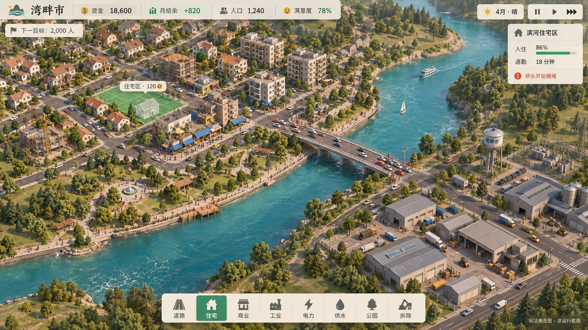

# 湾畔市：城市建设与经营设计稿

版本：0.1 · 2026-09-26  
定位：单人、桌面浏览器优先、可暂停的城市经营游戏。  
状态：设计提案；尚未实现游戏。概念图展示目标观感，图中的人口和收支为示意数值。

概念图由内置图像生成工具制作，展示画面、建筑功能和界面布局目标；画面精细程度不作为第一版全部达到的承诺。完整绘图提示词见 [生成说明](concept-generation.md)。图中的桥头拥堵仅是设计场景，实际试玩是否发生由道路布局与需求决定。

## 1. 玩家要得到什么

从一片河湾边的空地，亲手铺出道路、划出街区，看住宅、商店和工厂陆续出现；通过规划解决就业、通勤和公共服务问题，把小镇经营成有自己特色的城市。

首轮体验以 30–45 分钟为目标。之后可以继续自由建设。以下节奏、费用、容量与目标均为待试玩验证的设计值，并非已测得的结果，也不是参考作品的实际数值。

上一版生态模拟中的主要操作是调参数，然后观察小点运动。这次的主要操作必须发生在地图上：拉出道路、刷出分区、选址建设、检查街区、改造路网。人口和收入变化要能对应到可见的建筑与活动。

三条体验原则：

1. **做完就看得见。** 划区后出现工地；入住后亮灯、产生行人和车流；经营改善后建筑变高。
2. **每个问题有不止一种解法。** 堵车可以增加连接，也可以把岗位安排得更近；财政吃紧可以减缓扩张、调整税率或吸引更多企业。
3. **城市说明原因。** 点击一栋不发展的房子，能知道缺路、缺电、缺岗位还是污染高；提示必须关联真实模拟状态。

## 2. 研究依据与取舍

| 参考 | 官方资料支持的机制 | 本设计采用的部分 |
| --- | --- | --- |
| SimCity | 住宅、商业和工业分区；电力等公共服务；污染与拥堵等城市问题。 | 三类分区相互依赖，扩张会带来新的经营压力。 |
| Cities: Skylines II | 道路承载通勤与运输，交通信息视图显示瓶颈；分区有需求与适宜性，建筑会发展。 | 真实的路网连接关系、可解释的交通负荷、房屋随经营成果升级。 |
| ISLANDERS | 建筑位置与周边环境决定收益；达到门槛后开放更多建筑。 | 放置前给清楚反馈，按阶段开放少量新内容。 |

来源：

- [EA：SimCity 游戏概述](https://help.ea.com/en/articles/simcity/get-help/)
- [EA：SimCity 2013 官方手册，尤其第 10–15 页](https://akamai.cdn.ea.com/eadownloads/u/f/manuals/GAME-SIMCITY/SimCity_2013.pdf)
- [Paradox：Traffic AI](https://www.paradoxinteractive.com/games/cities-skylines-ii/features/traffic-ai)
- [Paradox：Zones & Signature Buildings](https://www.paradoxinteractive.com/games/cities-skylines-ii/features/zones-signature-buildings)
- [Paradox：City Services](https://www.paradoxinteractive.com/games/cities-skylines-ii/features/city-services-districts-policies)
- [Paradox：Economy & Production](https://www.paradoxinteractive.com/games/cities-skylines-ii/features/economy-production)
- [ISLANDERS：Steam 开发者介绍](https://store.steampowered.com/app/1046030/ISLANDERS/)

上述资料用于确认机制，不用于判断作品当前版本质量。下面的场景、玩法组合、数值和实现范围是原创设计建议。

## 3. 第一张地图：河湾两岸

- 一张约 64 × 64 个施工格的地图，西侧有唯一的对外公路入口。
- 河流把地图分成两片陆地；入口一侧空间较紧，另一侧有大片待开发土地。
- 开局只有入口路和 30,000 城市资金，玩家自己决定市中心、产业区与滨水空间。
- 两处预设的可架桥河段，减少早期操作复杂度，同时保留选址取舍。
- 住宅偏好干净、安静且通勤方便的位置；工厂靠近外部入口能减少货运绕行，但附近住宅会受污染影响。
- 河岸适合住宅和公园，也能承载道路与产业。玩家可以做不同选择，不设唯一正确布局。

**地图的标志性问题：** 怎样让河对岸发展起来，同时避免整座城市挤在唯一的桥上？

第一局不通过突发灾害强迫制造危机。拥堵、污染与赤字优先由玩家的扩张产生，而且都能在恶化前被看见。

## 4. 实际游玩循环

连接道路 → 划定住宅／商业／工业 → 提供水电 → 建筑自动施工与入住 → 获得税收和新需求 → 扩建或改造 → 城市升级。

玩家划分土地用途，私人建筑按需求自行生长。市政设施由玩家直接建设。这样既保留规划权，也能产生“我规划的街区自己活起来了”的感觉。

### 前 15 分钟的目标节奏

| 时段 | 玩家在做什么 | 城市反馈 | 设计目的 |
| --- | --- | --- | --- |
| 0–1 分钟 | 接通第一段路，建设小型供电站和水塔，刷出首片住宅 | 施工架出现，第一批家庭入住 | 尽快得到一个真实建设成果 |
| 1–3 分钟 | 增加工坊区和街角商店 | 产生岗位、通勤车与第一笔税收 | 学会住宅、岗位、消费的关系 |
| 3–6 分钟 | 根据居民需求扩张，观察支出 | 新路增加维护费，商业逐渐繁荣 | 形成第一次预算选择 |
| 6–10 分钟 | 修复由布局产生的问题，例如工厂贴近住宅或路口拥堵 | 警报减少，入住和收支改善 | 让“诊断—改造—验证”成为乐趣 |
| 10–15 分钟 | 达到桥梁解锁条件，决定何时开发另一岸 | 出现新街区，路网格局改变 | 给玩家明显的新规划空间 |

这些是体验目标，不是必须按时触发的脚本。若玩家提前规避问题，就给予发展奖励，不强制补发一场危机。

## 5. 第一版系统与规则

### 道路、分区与建筑

- 普通道路用拖拽绘制，显示沿格吸附的路径、总价、即将拆除的对象和连接状态。
- 分区提供画刷和矩形工具；住宅、商业、工业始终有文字、颜色与不同建筑轮廓作区分。
- 划区收一次性整地费，草案为每格 5；空地取消分区不返费，重复刷同一用途不重复扣费。私人建筑由需求推动，不需要玩家逐栋购买。道路和公共设施另外消耗城市预算。
- 分区建筑必须临路，并通过道路连接对外入口；孤立小路旁的房子不会凭空获得居民或服务。
- 未满足发展条件时保留规划色块，点击可见具体原因，不静默停滞。
- 初版建筑至少两档外观：小住宅／小公寓、街角店／商店楼、工坊／厂房。提高密度需要玩家允许，满足条件后才升级。
- 拆掉道路会影响连通性；拆迁预览先说明受影响的建筑。未推进时间的最近一次建设可撤销。

### 住宅、商业、工业的关系

- 住宅提供居民和劳动力，也需要岗位、消费与基础服务。
- 工业提供较多岗位和商业货源，同时产生货运车流与污染。
- 商业需要附近顾客、可达货源和员工；只有大片商业、没有顾客时不会无限繁荣。
- 开局允许通过入口进口商品；建设本地工业能降低商业供货成本，但不能靠重复进出口创造无限资金。
- 第一版不追踪每户家庭的完整账本，按建筑与街区汇总入住、就业和经营状况。
- 冷启动规则：首批最多 20 户开拓家庭在通路、有水电时即可入住，允许 3 个模拟月的求职宽限期。已竣工且具备基础服务的企业可先发布待招聘岗位，不要求员工满额才算岗位；未开工的规划格不能算岗位。这样居民与企业不会互相等待。

### 交通：简单，但确实影响经营

- 通勤由有人居住的住宅与有岗位的建筑之间产生；货运由入口、工业和商业之间产生。
- 需求沿真实道路图分配。路段有容量，负荷过高会延长通行时间。
- 交通变化影响住宅吸引力和企业效率；断路意味着不可达，而非轻微扣分。
- 地图上的少量车辆代表实际运输需求，其路线必须可达；屏幕车辆数不等于全部人口。
- 第一版保留两类补救方式：增加连接、调整用地布局；道路升级在发展里程碑后开放。
- 交通图层标出负荷／容量，点击路段显示主要流向。不能只用随机红绿颜色假装模拟。
- 道路发生变化时立即重算可达性；每个模拟月根据最近的通行时间重新分配需求，成本相近的可用路线允许分流，并平滑负荷变化，避免所有车流同时来回切换。多修一条没有优势的路不保证改善拥堵。

### 水电、污染与公园

- 电力与供水沿连通道路分配，同时受设施总容量限制。
- 建设时可见服务覆盖和剩余容量；缺水／缺电先抑制发展，持续短缺才使居民迁出。
- 水塔提供抽象供水，初版不做流体和地下管网编辑。
- 工业污染按距离衰减，住宅受影响，公园提升附近吸引力；公园不能直接抵消所有工业污染。
- 第一版使用一类小型供电设施、一类水塔和两种占地不同的公园，避免过多菜单。

### 财政与恢复机制

- 顶栏始终显示资金与月结余；悬停或点击展开税收、道路维护、市政设施维护。
- 基础税率从 9% 起，建议可调 6%–15%。增税能提高短期收入，也会削弱入住或企业需求。
- 模拟月与现实时间分离；暂定正常速度 45 秒为一个月，支持暂停、1×、3×。
- 预警显示“按当前结余预计还能维持几个月”，不等破产才报错。
- 默认标准模式下，资金不足时停止新的付费建设，但仍可调整税率、暂停设施或拆除回收部分成本。城市不会在一次误操作后立刻结束。
- 资金首次低于 3,000 时开放一次可选应急贷款：暂定借入 6,000，宽限 3 个月，再分 24 个月每月还款 300，总计 7,200。建造前显示新增还款负担。这是游戏内草案数值。
- 贷款只能使用一次；不保证所有残局都能恢复。长期失去收入来源时，可回到自动检查点重新规划。保留最近 3 个自动检查点，避免最新的破产状态覆盖全部可恢复记录。
- 不设重复赠款、拆建套利和无限出售收入；主要恢复路径来自调整城市结构。

### 初始数值草案

| 项目 | 建造成本 | 月维护 | 说明 |
| --- | ---: | ---: | --- |
| 普通道路 | 25／格 | 1／格 | 拖拽时累计显示 |
| 分区整地 | 5／格 | 0 | 24 格预览合计 120；私人建筑自行发展 |
| 小型供电站 | 2,500 | 150 | 容量与负荷需要试玩调整 |
| 水塔 | 1,500 | 80 | 沿连通路网供水 |
| 小公园 | 600 | 30 | 空间与持续支出的取舍 |
| 桥梁 | 3,500 起 | 80 起 | 按两处预设河段分别报价 |

首轮调参重点：开局必要设施应负担得起；只建设、不管理会逐渐吃紧；一次合理改造能被玩家感知。不能只根据人口增加而无限线性发钱。

## 6. 三个值得玩的取舍

**工厂要建多远？** 近：上班方便、路短；远：住宅更舒适，却需要更长的道路与货运连接。地图必须让这两种后果可见。

**先修桥，还是先经营好已有街区？** 修桥打开空间但吃掉预算；旧城加密能少花基建钱，却会增加原路网负荷。两种选择应能形成不同城市。

**靠扩张赚钱，还是靠提高已有区域质量？** 大量划区容易，配套和交通成本随后到来；公园、服务和路网改善能让已建街区发展，但回本更慢。

第一版不用十几类警报堆难度。重点让这三个取舍反复产生新的局面。

## 7. 成长与目标

| 里程碑草案 | 新能力或奖励 | 验证的体验 |
| --- | --- | --- |
| 首批 100 位居民 | 给首个街区命名 | 产生归属感 |
| 500 位居民且有稳定就业 | 桥梁、第二片发展空间 | 扩张带来城市形状变化 |
| 1,000 位居民 | 中密度分区和道路升级 | 建筑高度、交通问题进入新阶段 |
| 2,000 位居民、满意度 ≥70%、连续 3 个月不亏损 | 河湾地标与首阶段完成 | 奖励经营质量，而非单纯堆人口 |

完成后继续自由建设。地标是可放置奖励，需要付维护费，避免变成只弹出一张奖状。

## 8. 界面与画面

采用可缩放的斜俯视 3D，正交镜头，最多四个旋转方向。画面风格是清楚、温暖的低多边形城市，建筑可辨认出住宅、商店、厂房和市政设施；不使用点阵或纯色方块作为最终表现。

界面安排：

- **地图占主体。** 默认不被多张统计面板遮挡；放大能看街区，缩小能看全城关系。
- **顶部。** 资金、月结余、人口、满意度、日期与模拟速度。
- **底部。** 道路、住宅、商业、工业、电力、供水、公园、拆除；选中工具后才展开必要选项。
- **右侧。** 只在选中对象时显示详情，例如入住率、岗位、通勤时间、当前问题。
- **左侧。** 一条当前发展目标，以及可折叠的城市警报。
- **信息图层。** 交通、水电、污染／吸引力；同一时间显示一个图层。

鼠标左键建造或选择，右键／Esc 取消当前工具，滚轮缩放，中键或空格拖拽平移。地图键盘操作提供方向键、旋转键与确认／取消；按钮有文字说明。触控与手机完整游玩后置，但设计稿与基础界面需能在较窄窗口阅读。

反馈不能只停留在数字：施工架、入住亮灯、商店开门、小车转弯、工厂装卸、公园散步、升级前后建筑轮廓变化，都要与真实状态对应。昼夜在第一版只做视觉效果，不额外引入一套复杂作息经济。

## 9. 第一版交付范围

必须有：

- 一张河湾地图，道路、桥梁、三类分区、四类基础市政／景观选项。
- 建造预览、拆迁影响提示、未推进模拟前的单步撤销。
- 建筑自动生长与两级外观，居民入住与迁出，岗位和需求。
- 路网通达性、基础交通负荷、污染、水电容量、财政。
- 目标里程碑、原因明确的建筑检查器、至少三种信息图层。
- 暂停／倍速、本地自动存档、手动存档／读档、导出／导入存档。
- 一段可跳过的目标引导，允许不同建设顺序。

后续再扩展：公交线路、教育医疗、消防与灾害、旅游／科技专精、更复杂地形、真实车道调度、多级供应链、多人。第一版的城市经营闭环通过试玩后，再决定增加什么。

不把每个居民都接入大模型。当前玩法用明确规则就能运行，也更容易向玩家解释问题原因。

## 10. 实现顺序与验收

**阶段一：能建出一个街区。** 地形、镜头、铺路、分区、建筑生长、选择与撤销。先验证施工操作是否顺手，房屋出现是否有成就感。

**阶段二：街区之间发生关系。** 岗位、通勤、税收、水电、污染、入住与迁出。用同一随机种子比较不同布局，确认修路或改分区确实改变结果。

**阶段三：形成一局游戏。** 桥梁扩张、发展里程碑、建设反馈、引导、保存与恢复。补足视觉变化和音效后再评估乐趣。

模拟以地块、建筑和路段为主体，经济用固定时间步推进，画面独立渲染。道路变化后更新连通性和路线，每月按当前通行时间重新分配需求；大型人口使用汇总通勤需求，少量车辆负责展示。随机事件与建筑外观种子可重放，避免调试时每次结果不同。

验收场景：

1. 断开的住宅没有居民；补上连接后能发展。无法解释的停滞为缺陷。
2. 扩建工厂能改善就业，同时使附近污染或货运负荷增加。
3. 在预设通勤测试中增加一条耗时有竞争力、容量足够的替代路线，重分配后原瓶颈负荷下降；断开唯一桥梁会改变可达性。无效绕路不应自动获得改善奖励。
4. 税收、维护、建设扣费与拆迁回收可对账；暂停期间不扣模拟维护费。
5. 保存再读取后，地块、路网、建筑、资金、时间与随机状态一致。
6. 首次试玩者不需要看文档，也能建出首个有人居住的街区，并说出当前城市最需要解决的问题。
7. 连续试玩 15 分钟，玩家至少有一次主动改变布局来解决问题；若只是等钱和重复放楼，需要重新设计。

真正的第一版成功标准是：玩家能指着城市说，“这条路是我改的，修好之后那片地方终于发展起来了。”
